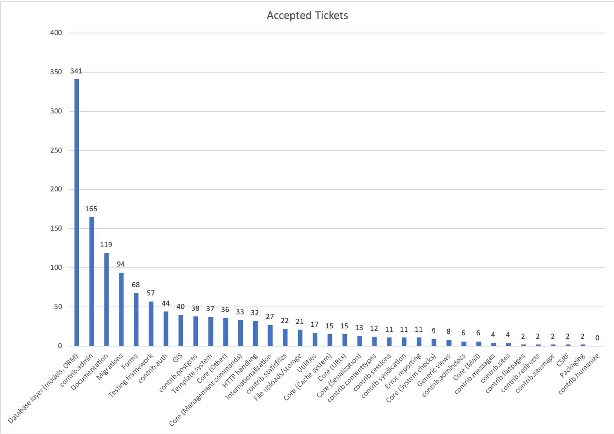

# dcus2019sprints
Notes for "Getting started contributing to Django" sprints workshop.

## Django's contributing guide

The canonical docs here are [the Contributing Guide](https://docs.djangoproject.com/en/dev/internals/contributing/).
The link there is to the index page. There's a lot to it! Explore.

Two good starting points are:

* [Advice for new contributors](https://docs.djangoproject.com/en/dev/internals/contributing/new-contributors/)
* [Writing your first patch for Django](https://docs.djangoproject.com/en/dev/intro/contributing/) (Tutorial)
* [Running the unit tests](https://docs.djangoproject.com/en/dev/internals/contributing/writing-code/unit-tests/)

The last one there is a good _Quickstart_.

## Getting set up with the code

The goals is to get Django source code and be able to run the test suite.

1. Fork the main [django/django](https://github.com/django/django) repo on GitHub
2. `git clone` your fork. — You've now got Django's source code on your laptop. 💃
3. Create a virtual environment.
4. Install Django as _editable_: `pip install -e .`
5. Install the test requirements. `cd tests && pip install -r requirements/py3.txt`
6. Run the tests. `./runtests.py`

This should run the tests locally against SQLite. They should pass.

If you have difficulties installing the requirements, there may be missing
dependencies and such. We'll have to look into those. Reach out.

**On macoOS?**: you may need to set an environment variable to run the tests:

    export OBJC_DISABLE_INITIALIZE_FORK_SAFETY=YES

### Using Docker

An alternative is to use Docker. We have a [`django-docker-box`](https://github.com/django/django-docker-box)
project for that.

This option is particularly good if you want to work on the ORM, because it
lets you test against all the supported DBs.

## Finding a ticket

Django uses Trac for issues and GitHub for PRs.

<code.djangoproject.com>

Trac is a bit different from GitHub Issues. It's more powerful, and it has the
history from the many years of Django's history.

It can seem a bit intimidating, but a after a few minutes exploring it's starts
to make sense. (Hopefully anyway… 🙂)

- Visit https://code.djangoproject.com/query — It will show all open tickets.
  Some 1300-odd. That's too many. We need to filter if we're going to get
  anywhere.

- Visit https://dashboard.djangoproject.com — this shows some number and the
  titles link back to trac (or sometimes GitHub) with the matching filters
  already in place.

- Click on _"Easy" tickets_ — these are tickets that have been marked as _easy
  pickings_. We don't have many of them so marked. (We should be a bit more
  liberal with this…) But if they're not assigned, or are assigned but haven't
  been updated in months, they might be a good place to start.

- Filter by component: Go back to the full _View tickets_ list. In the _Custom
  query_ section click on the _And_ select and pick _Component_. This will add
  a drop down to just show tickets for a single component. Click a few. See.

    - The ORM and the Admin have the most tickets.
    - Other components have much less, so are easier to get to grips with.

Here's a graph showing it:

The numbers may be slightly outdated but the ordering and relative scale will
be about right.

[Documentation tickets](https://code.djangoproject.com/query?status=assigned&status=new&component=Documentation&col=id&col=summary&col=status&col=owner&col=type&col=component&col=version&desc=1&order=id)
 are another good place to look. There's a lot of them. They're a great way to
 learn, since you need to really understand an issue in order to be able to
 state clearly what's happening in the docs.

When you look at a ticket, you won't understand it instantly. It takes a bit of time to dig in and work out what's going on. That's true for everyone, fellows, veteran contributors and newcomers alike.

But most tickets aren't any harder than the problems you solve every day with Django. They just need time and energy.

Here's a filter for [Needs
Documentation](https://code.djangoproject.com/query?status=assigned&status=new&needs_docs=1&col=id&col=summary&col=status&col=component&col=owner&col=type&col=version&desc=1&order=id).
There's a hundred or so.

Many of these have patches but are stuck needing clearer documentation. Again,
this can be a good place to come in and help finish a PR off.

One final place to look, is on GitHub at the open PRs. Sort by Least Recently Updated. How come a PR hasn't been closed but hasn't been worked on either. These may be towards the more challenging end — or it may be the _Needs Documentation_ type issue that we just saw — but can you find a PR to help finish off here?

Beyond that, it's a question of finding a ticket, and digging in. It's hard to say too much generally — it depends on which ticket you find.
